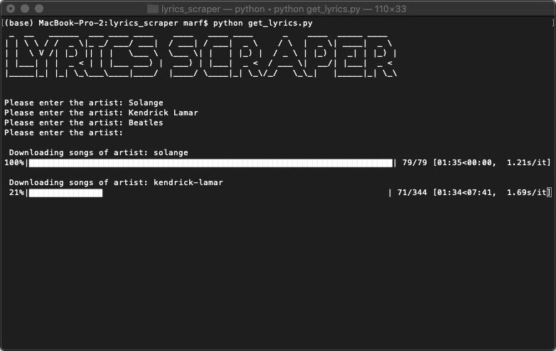
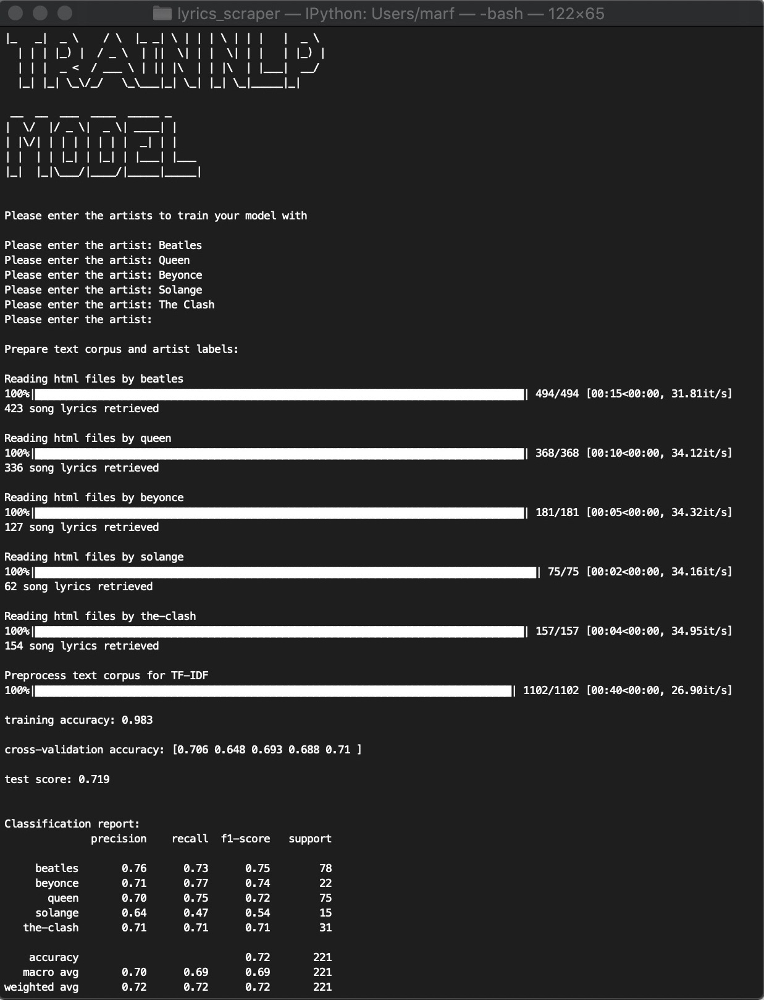
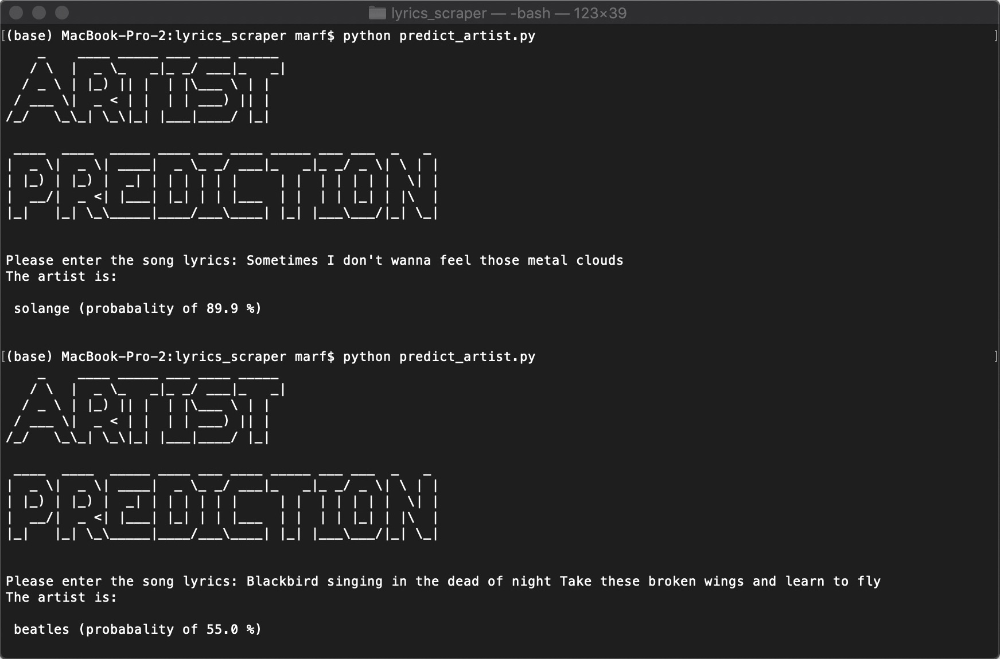

# Lyrics Classifier

The project performs webscraping on [www.metrolyrics.com](www.metrolyrics.com) to download the song lyrics.
Based on a set of artist lyrics a Multinomial-Naive-Bayes model is trained using bag-of-words and SMOTE Oversampler.
This model is used then to predict the artist to a given song line.

## Downloading Lyrics
Run `python get_lyrics.py`

## Train Model
Run `python model.py` to train model based on specified artists.

## Predict artist
Run `python predict_artist.py`

